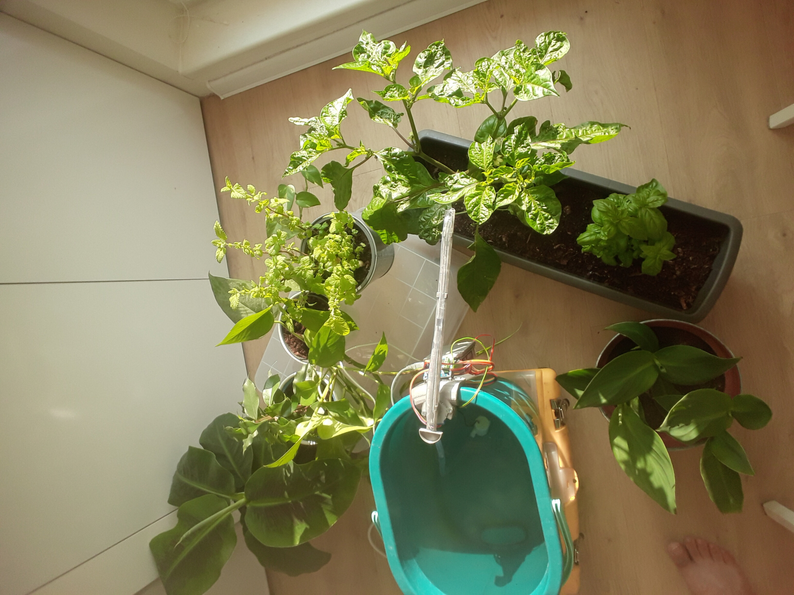
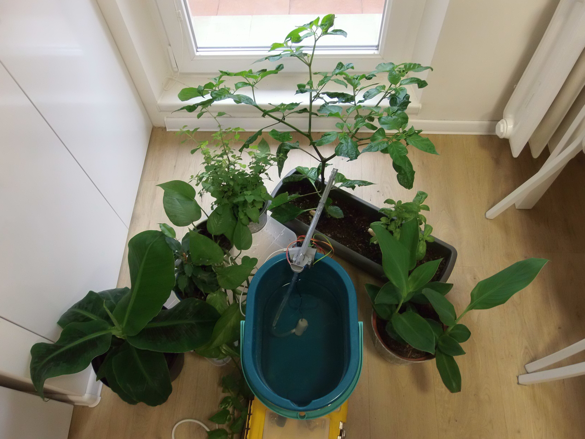

# plant-guard

A simple plant watering machine.
Used parts:
  - Raspberry Pi 3 B+
  - Submersible Low Noise Motor Pump 3-6V
  - Motor driver l293d
  - Stepper motor 28BYJ-48 with driver
  - Silicon hose
  - Bucket
  - 3d-printed parts (see `models`, Note: it's suggested to create your own models to fit your bucket and hose + there are errors in the models present which needed to be manually corrected (sawing and bending was easier for me than toiling with FreeCAD which is terrible when changing parameters etc.))
  - dupont cables, screws, ...

No sensors are used for now, you will need to set appropriate timing for the frequency and duration of the watering (Keep in mind the watering will be slower when the bucket is emptier).

Usage:
  1. Assemble using the datasheets of the components (GPIO pins for the pump driver are 5 (->IN1) and 6 (->IN2), GPIO pins for the stepper motor driver are 24, 23, 22, 27 (-> IN1, IN2, IN3, IN4)) and mount onto the bucket
  2. `ssh pi@raspberrypi.local`
  3. `git clone https://github.com/afrixs/plant-guard.git`
  4. `pip3 install python_crontab pyyaml portalocker`
  5. Set the arm to point directly outwards from the bucket
  6. `python3 plant-guard/plant_guard_control.py`
  7. Use arrow keys to move the arm. Repeat the last arrow key stroke to stop. When the arm is above the plant being configured use 'f' key to set `angle_from`. Optionally move the arm a little bit and use 't' key to set `angle_to`. The arm will be moving between `angle_from` and `angle_to` during the watering so that water does not fall to a single spot only.
  8. Use 'p' key to start/stop the pump. Duration of pumping will be stored to `pump_dur`.
  9. Use 'Enter' key to create a watering job. Enter a name for the job and a crontab time entry
  10. The watering job is scheduled. Repeat 6.-8. for another plant
  11. Use 'l' key to list all jobs, 'd' key to delete a single job or 'x' key to delete all jobs
  12. Use 'q' or 'Esc' key to quit the job configuration client. Lock for controlling motors is released and scheduled jobs are free to run
  13. You can now use Ctrl+D to logout from ssh

Note: You may edit the jobs afterwards using `crontab -e` or `nano ~/plant-guard/jobs.yaml`.

Important note: Don't turn the stepper motor manually after the first start or the configuration will be broken. If you need (or accidentally happen) to turn it, use `rm ~/plant-guard/save.txt; rm ~/plant-guard/save_backup.txt` and follow steps 4. - 12. to reconfigure (or turn the motor back to its original position, hoping the difference will not be critical).

Important note: Also when leaving the device to operate without your attendance for a longer time, prepare the place in a way that no firm or big leaves capable of blocking the movement of the arm will grow in its way.

First test was successful: Here are images of our plants before and after leaving the apartment for 9 days. I think they liked it

