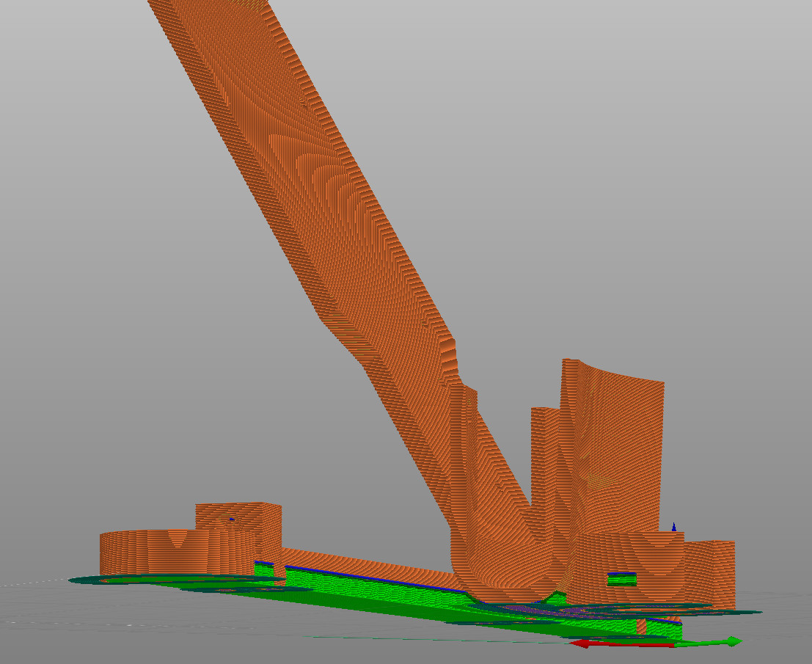

# Models
These are models to be 3D-printed for the robot. Basically you need to print each `.3mf` file once.
I use [PrusaSlicer](https://www.prusa3d.com/) for slicing and generating gcode.

## Editing
Probably (unless you happen to have same bucket and components as me) you'll need to edit
some parts. Currently I suggest using [toponaming](https://github.com/FreeCAD/FreeCAD/tree/development/toponaming) branch of
FreeCAD and (to prevent headaches) **not mapping anything on 3D features**, i.e. project only geometry from sketches and
use DatumPlanes and parametric expressions to achieve proper structure, otherwise recomputing hell will come upon you
with refernces jumping from one feature to another etc.

After editing and exporting the models, there is a `Reload from disk` feature in PrusaSlicer.

After reloading from disk you will want to add supports to all overhangs under 40˚ for `arm-Arm.stl` and 50˚ for `arm-Base.stl` and to disable supports in screw and nut holes, because 3D printer usually can handle small bridges like those and much of filament and printing time can be spared. Final supports could be like what you see (green color) in the image below.

Note: I haven't printed this version of `arm-Base.stl` model (I printed just a previous buggy version where the roof for RPi and motor driver didn't lean), so maybe you will need to play with print params (increase brim etc.) to print the model successfully.

